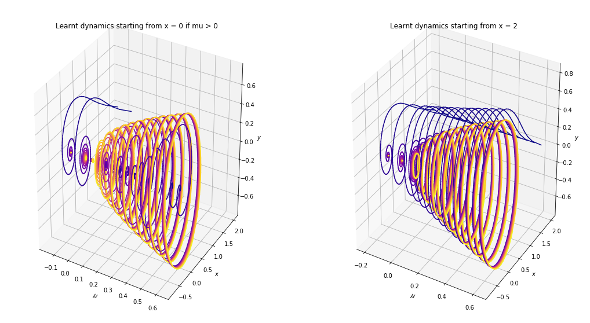

# Empirical Dynamic Modeling of Biochemical Systems with Machine Learning

## Master Thesis

Empirical Dynamic Modeling for [Systems Biology](https://en.wikipedia.org/wiki/Systems_biology) with Machine Learning  
Kevin Siswandi  
May 2020  
https://github.com/jpahle/LMMNet  

### About the Project

Main contributions:
* we show how data-driven dynamic modeling can be formulated as a supervised learning problem that is solved with machine learning methods
* we blend the classical theory of Linear Multi-step Method with machine learning and neural networks (hence LmmNet).
* we evaluate the methods on canonical and complex biochemical systems

The method is also capable of identifying bifurcation:




Keywords:
- Dynamical Systems
- Systems Biology
- Machine Learning
- Neural Network

Traditionally, the method of discovering dynamics from data was known as *system identification* before machine learning libraries were made open-source commodity. However, systems identification is recognized as a hard problem in the physical sciences. Here, I want to show that a machine learning approach can help accelerate and transform how dynamic modeling is done in the sciences.


### Software and Libraries

* Deep Learning Framework: TensorFlow 2.x
* Machine Learning Library: Scikit-learn, TPOT
* Numerics Framework: NodePy, SymPy
* Scientific Computing Stack: SciPy, NumPy

### References

The primary materials I consult are
* [Keller & Du (2020)](https://arxiv.org/abs/1912.12728): Study of the convergence properties of LMM for learning dynamics
* [Raissi, Perdikaris & Karniadakis (2018)](https://maziarraissi.github.io/research/7_multistep_neural_networks/): Multistep neural network for discovery of dynamics on benchmark problems
* [Systems Identification](https://www.mathworks.com/help/ident/gs/about-system-identification.html): Introduction to mathematical modeling of dynamical systems from measurements.
* [Kanschat & Scheichl (2019)](https://www.mathsim.eu/~gkanscha/notes/ode.pdf): Lecture notes on numerical methods for ODE, including LMM (chapter 5)
* Villaverde, A. F. & Banga, J. R. Reverse engineering and identification in systems biology: strategies, perspectives and challenges. J. R. Soc. Interface 11, 20130505 (2013).
* [Rackauckas, Ma, Martensen, Warner, Zubov, Supekar, Skinner, Ramadhan (2020)](https://arxiv.org/abs/2001.04385): Augmentation of differential equations with machine-learnable components (termed Universal Differential Equations/UDE) for discovering governing equations from data
* [Bier, Bakker, Westerhoff (2000)](https://www.ncbi.nlm.nih.gov/pmc/articles/PMC1300712/): ODE Model for 2-D Yeast Glycolytic Oscillator
* [Costello & Martin (2018)](https://www.nature.com/articles/s41540-018-0054-3): Prediction of dynamics by explicitly computing the derivatives to get labeled data, applied to the mevalonate pathway.
* Villaverde, A. F. & Banga, J. R. Reverse engineering and identification in systems biology: strategies, perspectives and challenges. J. R. Soc. Interface 11, 20130505 (2013).
* [Universal Differential Equations for Scientific Machine Learning](https://arxiv.org/abs/2001.04385)


### Comparison with previous approach

One difference is in the design choice: previous approach trained a different model for every species (dependent variable) considered. That is, the model assumed a mapping from multi-species concentrations X to single species derivatives y. The training is the repeated for all 10 metabolites.

```
For i in 1 to 10:
    Train model to approximate the function mapping
    Metabolite1, Metabolite2, ..., Protein1, Protein2, ... -> Derivative of Metabolite i
```

However, in LmmNet, we reconstruct the dynamics of all species using a single function mapping

`species1, species2, species3 -> species1, species2, species3`

Advantages of LmmNet:
* multi-step instead of single-step
* avoids artificial computation of the derivatives to create suitable training data

Disadvantages of LmmNet:
* assumes regularly sampled time-series data (obvious solution: preprocessing)


